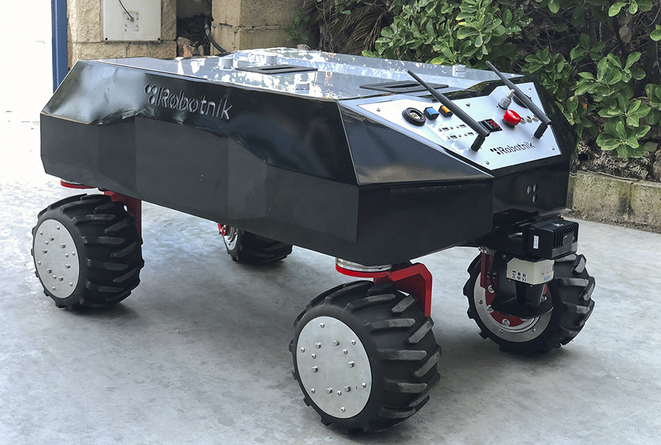
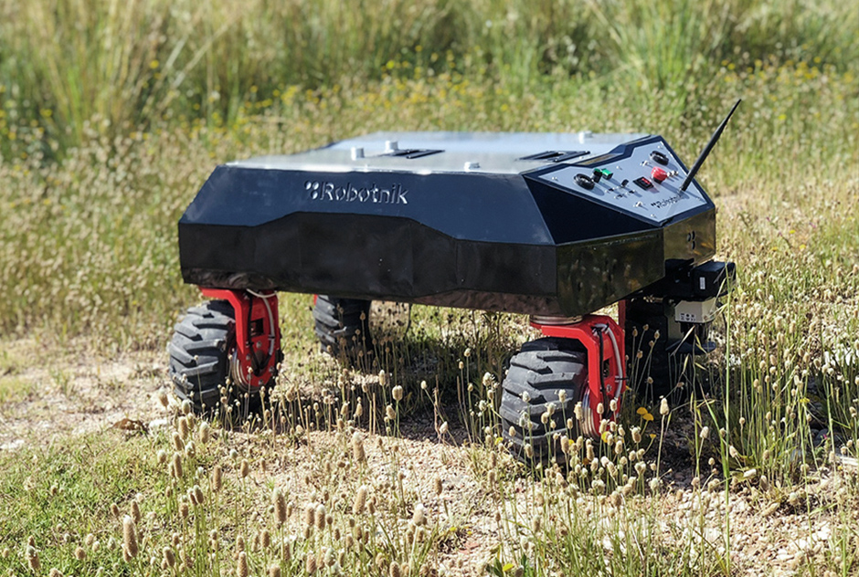

# heron_common

  
  

Common packages of the Heron RB-Vogui XL: URDF description of the HERON tools integrated in the RB-Vogui XL, platform messages and other files for simulation.

## packages

### heron_control

This package contains the launch and configuration files to spawn the joint controllers (omni_drive_controller or ackermann_drive_controller) with the ROS controller_manager. 

### heron_description

The urdf, meshes, and other elements needed in the description are contained here.

### heron_localization

This package contains all the configuration files needed to execute the amcl algorithm serving a map or you can use the gmapping to make your own map of a world and test the amcl with it! 

### heron_localization
This packages contain the files needed to run move_base or simple goals with move.
